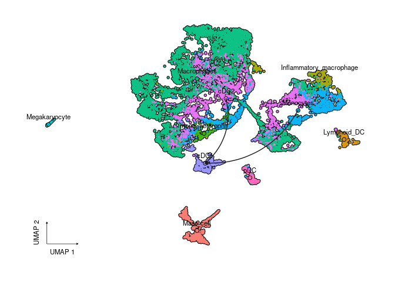
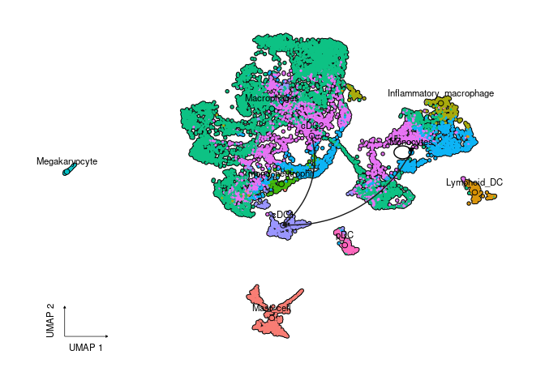
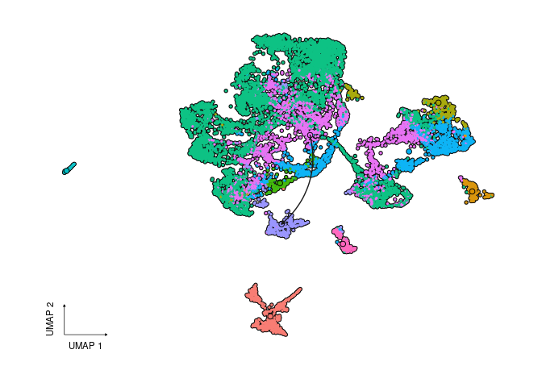
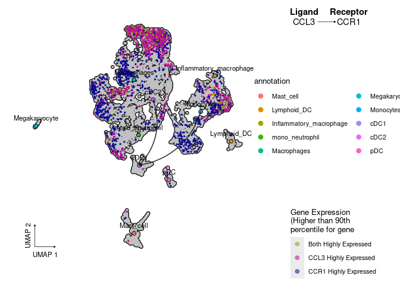
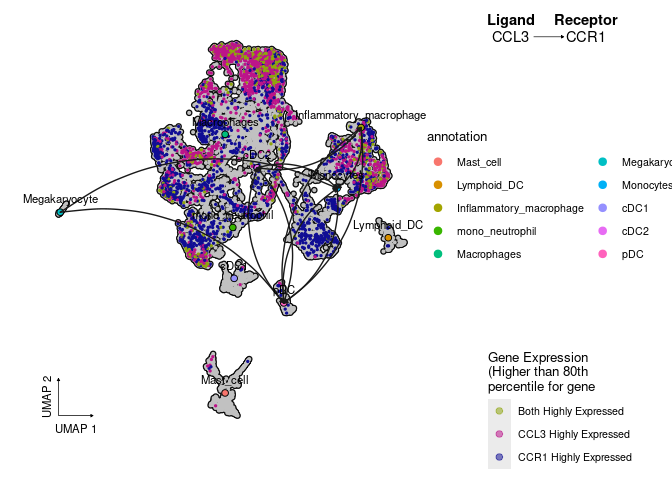
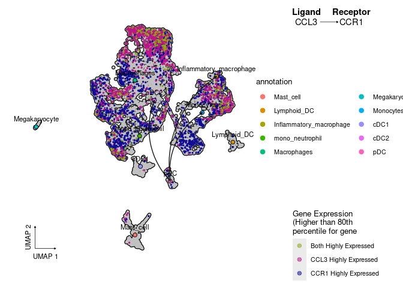
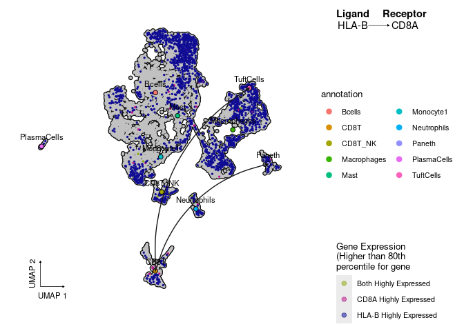

Example Cell-Cell Interactions on a UMAP
================
Rachel D. Edgar
2024-08-07

## Source plot functions

There are a few variations of the plot available in a few different
functions, plus some support functions to tidy data.

``` r
source("scripts/generalised_cell_cell_interaction.R")
```

## Load example seurat object

## Make a simple cell-cell interaction data structure

This is the more general structure. Cell-cell interactions could be from
receptor-ligand interaction predictions, measured surface receptors,
whatever!

``` r
cell_cell_connections<-data.frame(Cell1=c("cDC2","Monocytes","Monocytes"), Cell2=c("cDC1","cDC1","Monocytes"))
cell_cell_connections
```

    ##       Cell1     Cell2
    ## 1      cDC2      cDC1
    ## 2 Monocytes      cDC1
    ## 3 Monocytes Monocytes

## Colour UMAP by Cell Type

This function takes arguments as follows: seurat object, column name of
cell type, a data.frame structured like “cell_cell_connections”.

Optional arguments: ligand_cell_type - do you want to limit the curves
drawn to only starting at one cell type of interest? For example only
cDC2 cells self_interactions - do you want to see loops for when cells
are interacting with themselves? label_cell_type - do you want text
labels for the cell types Defaults: ligand_cell_type = NA,
self_interactions = F, label_cell_type = T

``` r
plot_gene_UMAP_color_bycelltype(d10x, "annotation",cell_cell_connections)
```

<!-- -->

``` r
plot_gene_UMAP_color_bycelltype(d10x, "annotation",cell_cell_connections, self_interactions = T)
```

<!-- -->

``` r
plot_gene_UMAP_color_bycelltype(d10x, "annotation",cell_cell_connections,ligand_cell_type = "cDC2", label_cell_type=F)
```

<!-- -->

## Colour UMAP by expression of two genes

This function takes arguments as follows: seurat object, column name of
cell type, a data.frame structured like “cell_cell_connections”,
receptor gene name, ligand gene name (don’t have to be receptor and
ligands just a common use case).

Optional arguments: ligand_cell_type - do you want to limit the curves
drawn to only starting at one cell type of interest? For example only
cDC2 cells self_interactions - do you want to see loops for when cells
are interacting with themselves? label_cell_type - do you want text
labels for the cell types percentile - the percentile cut off to call a
gene as “highly expressed” and color a cell as having that gene “on”
Defaults: ligand_cell_type = NA, self_interactions = F, label_cell_type
= T,percentile = 0.8

``` r
plot_gene_UMAP_exp_colored(d10x,"annotation" ,cell_cell_connections, ligand = "CCL3", receptor="CCR1")
```

<!-- -->

``` r
plot_gene_UMAP_exp_colored(d10x,"annotation" ,cell_cell_connections, ligand = "CCL3", receptor="CCR1", percentile = 0.9)
```

<!-- -->

``` r
plot_gene_UMAP_exp_colored(d10x,"annotation" ,cell_cell_connections, ligand = "CCL3", receptor="CCR1",ligand_cell_type = "cDC2")
```

<!-- -->

## Using cellphonedb output

This code is an example of the function to format cpdb data to structure
it like cell-cell connection data.

``` r
cpdb_output<-read.table("data/example_statistical_analysis_significant_means_03_05_2024_15:06:27.txt", sep="\t", header=T)
cell_cell_connections<-cell_cell_format_cpdb(cpdb_output, receptor="CCR1",ligand="CCL3")
head(cell_cell_connections)
```

    ##           Cell1                   Cell2 gene_a gene_b value
    ## 469   Monocytes               Monocytes   CCL3   CCR1 0.383
    ## 3022  Monocytes                     pDC   CCL3   CCR1 0.412
    ## 25999       pDC               Monocytes   CCL3   CCR1 0.732
    ## 28552       pDC                     pDC   CCL3   CCR1 0.761
    ## 31105       pDC                    cDC2   CCL3   CCR1 0.532
    ## 46423       pDC Inflammatory_macrophage   CCL3   CCR1 0.668

``` r
plot_gene_UMAP_exp_colored(d10x,"annotation" ,cell_cell_connections, ligand = "CCL3", receptor="CCR1")
```

<!-- -->

``` r
plot_gene_UMAP_exp_colored(d10x,"annotation" ,cell_cell_connections,ligand_cell_type = "pDC",ligand = "CCL3", receptor="CCR1")
```

<!-- -->

## Using CellChat output

This code is an example of the function to format CellChat data to
structure it like cell-cell connection data.

d10x in this example is a seurat object which the cellchat was run on.
“annotation” is the name of the cell label column in that seurat object.

``` r
library(CellChat)
```

    ## Loading required package: igraph

    ## 
    ## Attaching package: 'igraph'

    ## The following objects are masked from 'package:dplyr':
    ## 
    ##     as_data_frame, groups, union

    ## The following object is masked from 'package:Seurat':
    ## 
    ##     components

    ## The following objects are masked from 'package:stats':
    ## 
    ##     decompose, spectrum

    ## The following object is masked from 'package:base':
    ## 
    ##     union

``` r
load("../../Downloads/cellchat_merged.RData")


df.net <- subsetCommunication(cellchat)
head(df.net$Healthy)
```

    ##         source target ligand receptor        prob pval interaction_name
    ## 1 BEST2+Goblet  AAMac  GDF15   TGFBR2 0.011978050    0     GDF15_TGFBR2
    ## 2  Epithelial1  AAMac  GDF15   TGFBR2 0.003751230    0     GDF15_TGFBR2
    ## 3      Goblet1  AAMac  GDF15   TGFBR2 0.002357140    0     GDF15_TGFBR2
    ## 4    Monocyte2  AAMac  GDF15   TGFBR2 0.004938141    0     GDF15_TGFBR2
    ## 5        Tregs  AAMac  GDF15   TGFBR2 0.003727528    0     GDF15_TGFBR2
    ## 6 BEST2+Goblet Bcells  GDF15   TGFBR2 0.002549273    0     GDF15_TGFBR2
    ##   interaction_name_2 pathway_name         annotation       evidence
    ## 1     GDF15 - TGFBR2          GDF Secreted Signaling KEGG: hsa04350
    ## 2     GDF15 - TGFBR2          GDF Secreted Signaling KEGG: hsa04350
    ## 3     GDF15 - TGFBR2          GDF Secreted Signaling KEGG: hsa04350
    ## 4     GDF15 - TGFBR2          GDF Secreted Signaling KEGG: hsa04350
    ## 5     GDF15 - TGFBR2          GDF Secreted Signaling KEGG: hsa04350
    ## 6     GDF15 - TGFBR2          GDF Secreted Signaling KEGG: hsa04350

``` r
cell_cell_connections<-cell_cell_format_cellchat(df.net$Healthy, receptor="CD8A",ligand="HLA-B")
head(cell_cell_connections)
```

    ##             Cell1 Cell2 gene_a gene_b      value
    ## 9187        AAMac  CD8T  HLA-B   CD8A 0.13023927
    ## 9188       Bcells  CD8T  HLA-B   CD8A 0.13842550
    ## 9189 BEST2+Goblet  CD8T  HLA-B   CD8A 0.08729063
    ## 9190    CD103+DCs  CD8T  HLA-B   CD8A 0.14102723
    ## 9191         CD4T  CD8T  HLA-B   CD8A 0.13679200
    ## 9192         CD8T  CD8T  HLA-B   CD8A 0.15107675

``` r
############# this should be deleted with real data #################
# d10x is the seurat object cellchat was run on
## using a fake seurat object here to match cell names from cell chat
d10x$annotation<-as.factor(d10x$annotation)
levels(d10x$annotation)<-c("CD8T","Paneth", "TuftCells",unique(cellchat@meta$annotation)[1:7])
d10x$annotation<-as.character(d10x$annotation)
#####################################################################

plot_gene_UMAP_exp_colored(d10x,"annotation" ,cell_cell_connections,ligand_cell_type = "CD8T",ligand = "HLA-B", receptor="CD8A")
```

<!-- -->
